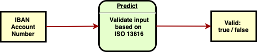
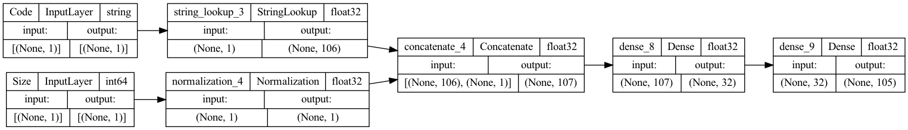
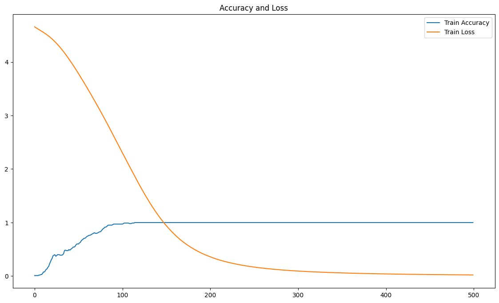
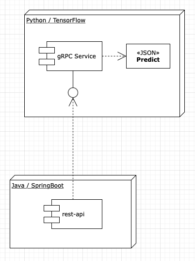
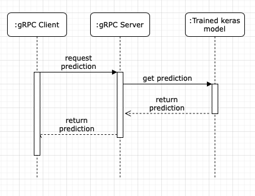

# IBAN Validator Model

> ML model for validating IBAN account numbers.

This is an open-source project which delivers a machine learning model for validating [IBAN](https://www.iso13616.org)
account numbers accessible via [gRPC](#grpc-service) and [REST](#rest-api) APIs.

The [trained model](#trained-model) is distributed in two forms:

 - As a [Notebook at Kaggle](https://www.kaggle.com/code/brunosantanna/iban-validator-model/notebook) for interactive experimentation.
 - As a [Docker Image](https://hub.docker.com/r/bsantanna/iban-validator-model) which contains all
runtime [dependencies](#dependencies) and is used now as basis example for cloud related projects.

The project source code is available at [bsantanna/iban-validator-model](https://github.com/bsantanna/iban-validator-model) Github repository.


## Table of contents

* [Container Image](#container-image)
* [Usage example](#usage-example)
* [Project description](#project-description)
  * [The challenge](#the-challenge)
  * [The proposed solution](#the-proposed-solution)
  * [Dependencies](#dependencies)
  * [Trained Model](#trained-model)
  * [Module organization](#module-organization)
    * [Training](#training)
    * [Prediction](#prediction)
      * [gRPC Service](#grpc-service)
      * [REST API](#rest-api)
* [Conclusion and references](#conclusion-and-references)
* [Changelog](#changelog)
* [License](#license)


## Container Image

One deliverable of this project is
a [Docker Image](https://hub.docker.com/r/bsantanna/iban-validator-model) which can be used following
this [project license](#license).

> Disclaimer:
>
> - The dataset may be outdated in comparison to the latest IBAN registry / country information.
> - This model was created for case study purposes and may predict incorrect results.
> - Use the model at your own discretion.

To run this image with Docker use the following command:

```bash
$ docker run -it --rm -p 41151:41151 -p 8080:8080 bsantanna/iban-validator-model
```

After some moments a container should spawn two processes:

- A Python [gRPC](#grpc-service) listening on port 41151.
- A Spring Boot / Java [REST API](#rest-api) listening on port 8080.


> Apple Silicon users:
> 
> - To run the docker image use this alternative tag: `bsantanna/iban-validator-model:aarch64`
> - To run the notebooks of this repository, consider [following these instructions](https://developer.apple.com/metal/tensorflow-plugin/).
>


## Usage example



With example IBAN accounts from [https://bank.codes](https://bank.codes/iban/examples/).

IBAN to validation data JSON:

```bash
$ curl -s \
  "http://localhost:8080/validation?iban=BR1800000000141455123924100C2"
```

Gives the following result output:

```json
{
  "classification": {
    "bban_regex": "[0-9]{23}[A-Z]{1}[A-Za-z0-9]{1}",
    "check_digit_regex": "[0-9][0-9]",
    "code": "BR",
    "country": "Brazil",
    "size": 29
  },
  "description": "IBAN passed validation",
  "iban": "BR1800000000141455123924100C2",
  "is_valid": true
}
```


## Project description

Main motivation for creating this project was study and self development in the subjects
of [Deep Learning](https://en.wikipedia.org/wiki/Deep_learning)
and [Artificial Neural Networks](https://en.wikipedia.org/wiki/Artificial_neural_network)
using [Tensorflow](https://www.tensorflow.org), a popular Machine Learning Platform.

Considering the Artificial Intelligence domain landscape in the year of 2022, several Machine Learning SaaS and PaaS
offers available in the market in a field of computer science that just had become a mainstream topic. It just made
sense to me picking one major framework and start practicing with a well known problem such as IBAN validation.

As a software engineer, with this project I had found answers to some of my practical questions and was rewarded with
proficiency in modeling neural networks and distributing them for prediction at scale using cloud containers.

### The challenge

Looking for an idea for a hands-on/short-lived project to practice and learn Neural Network modelling
with [Keras](https://keras.io/api/) and [TensorFlow](https://www.tensorflow.org/), I came across this idea of creating
this [IBAN](https://www.iso13616.org) validator as this is a simple use case with good references over the internet.

### The proposed solution

In order to employ a simple yet efficient Machine Learning Model, the proposed solution
addresses the challenge using the following approach.

> 1. The Machine Learning Model should memorize [a table](](https://github.com/bsantanna/iban-validator-model/blob/main/modules/training/data/country_validation_json.csv)) with country
     specific [Regular Expression](https://en.wikipedia.org/wiki/Regular_expression) rules formatted as static JSON
     document strings.
> 2. Predict the correct JSON when other items from the table are given as features, extracted from the
     input [IBAN](https://www.iso13616.org); 2-letter [ISO 3166-1](https://en.wikipedia.org/wiki/ISO_3166-1) country
     code and length / size.
> 3. Use language specific regular expression to parse predicted JSON and validate the
     input [IBAN](https://www.iso13616.org)

### Dependencies

Project development environment and dependencies:

- [Jupyter](https://jupyter.org): Used as interactive development environment.
- [Matplotlib](https://matplotlib.org): Used for plotting error loss function result over epochs to measure training
  results.
- [Pandas](https://pandas.pydata.org/pandas-docs/stable/): Used as main tabular data manipulation framework.
- [TensorFlow](https://www.tensorflow.org/api_docs/python/tf): Used as Machine Learning Platform and one of the main
  topics of interest of this project.
- [Keras](https://keras.io/api/): Used as Deep Learning and Neural Network fluent design API and another of the main
  topics of interest of this project.
- [gRPC](https://www.grpc.io): Used for system integration and Remote Procedure Call Framework.
- [SpringBoot Web](https://spring.io/projects/spring-boot): Used as Dependency Injection Container, REST Framework API
  and System Integration proof-of-concept.

### Trained Model

Trained model was constructed using [Keras Functional API](https://keras.io/guides/functional_api/).



#### Inputs
As per illustration above, two input parameters are given to the model:

- Code: 2-letter ISO 3166-1 country code
- Size: IBAN length

#### Hyper-parameters

In relation to [hyper-parameters](https://en.wikipedia.org/wiki/Hyperparameter_(machine_learning)), the following configuration was used during training:

- Input dataset 105 with items
- 500 epochs
- Mini batch input with size of 32
- [Adam](https://keras.io/api/optimizers/adam/) as optimizer function, Adam is a computation efficient variant of stochastic gradient descend.
- [Categorical cross entropy](https://keras.io/api/losses/probabilistic_losses/#categoricalcrossentropy-class) as error loss function.

#### Output

The output prediction returns an array of probabilities with the maximum probability corresponding to the correct JSON document.

Resulting training process can be observed in the following chart:



 - x-axis corresponds to training epochs.
 - y-axis corresponds to error loss and accuracy scalar values.
 - Chart indicates a progression in accuracy and reduction in loss over the training epochs.

In relation to the model fitting, in this use case over-fitting is not an undesired side effect but rather a requirement, the model need to adapt to the specific tabular data and "memorize" it. 

Specific details of the model and Neural Network Topology can be observed in the
notebook [JSON Prediction Model](https://github.com/bsantanna/iban-validator-model/blob/main/notebooks/training/json/json_prediction_model.ipynb), which served as main development and experiment environment.

A prediction example which loads trained model can be observed in the notebook [JSON Classification](https://github.com/bsantanna/iban-validator-model/blob/main/notebooks/prediction/json_classification.ipynb)


### Module organization

While Jupyter notebooks are great for prototyping purposes, in order to distribute the model code was formatted in a [continuous delivery](https://en.wikipedia.org/wiki/Continuous_delivery) ready structure under the `modules/` directory and that also permitted introduction of simple use case of integration using [Java](#rest-api) and [gRPC](#grpc-service).

#### Training

Training module contains code used for declaring, compiling and training the model.

The most important files are:

 - [training/json_classification_model.py](https://github.com/bsantanna/iban-validator-model/blob/main/modules/training/json_classification_model.py) corresponds to the code used to declare, compile and train the model.
 - [training/data/country_validation_json.csv](https://github.com/bsantanna/iban-validator-model/blob/main/modules/training/data/country_validation_json.csv) corresponds to training input dataset.
 - training/data/json_classification_model/... corresponds to trained model serialized and stored in binary file format for further reuse.

The training process can be performed using the following command (from modules/training directory):

```bash
$ python3 json_classification_model.py
```

### Prediction

Prediction module contains system integration and service interface declaration. 



#### gRPC Service

The gRPC service serves as main integration point as it creates a Remote Procedure Call pointing to trained model Prediction.



The gRPC server process can be started using the following command (from modules/prediction/service directory):

```bash
$ python3 json_classification_service.py
```

If all dependencies and pre-conditions are met, the model should be loaded into memory and gRPC server should start listening for requests on port `41151`

The service implements the server side of the following gRPC / Protobuf contract:

```protobuf
syntax = "proto3";

service JSONClassificationService {
  rpc getPrediction(InputFeatures) returns (OutputLabel) {}
}

message InputFeatures {
  string iban = 1;
}

message OutputLabel {
  string json = 1;
}
```

 - Contract publishes a service interface `getPrediction` which receives an `InputFeatures` object and returns an `OutputLabel` object.
 - `InputFeatures` object contains a single attribute `iban` with type string.
 - `OutputLabel` object contains a single attribute `json` with type string.
 - The implementation used [official gRPC documentation](https://www.grpc.io/docs/languages/python/quickstart/) as reference.  

#### REST API

A HTTP REST API is another deliverable of this project, it was created to simulate system integration scenario with gRPC client for the same contract served by the [gRPC Service](#grpc-service).

The following endpoints are available:
 
 - GET `/json-prediction` : Returns raw json classification predicted by model without regex validation 
 - GET `/validation` : Returns validation and embedded predicted classification
 
Both endpoints accept a single query parameter `iban`

Assuming a Java Development Kit is available, there is a maven project under `modules/prediction/rest-api`, which can be built and executed using the following commands:

```bash
$ cd modules/prediction/rest-api
$ mvn clean install
$ java -jar target/rest-api.jar
```

See [usage example](#usage-example) for a quick reference.


## Conclusion and references

The project reached its original goal of designing and implementing an Artificial Neural Network for validating IBAN account numbers.

The following items can be considered project deliverables:
 
 - A [IBAN / Country Regular Expression Dataset](https://www.kaggle.com/datasets/brunosantanna/iban-country-regex)
 - Tensorflow / Keras [model implementation](#trained-model).
 - A [notebook at Kaggle](https://www.kaggle.com/code/brunosantanna/iban-validator-model/notebook).
 - Docker Image [bsantanna/iban-validator-model](https://hub.docker.com/r/bsantanna/iban-validator-model) (x86_64 architecture only)
 - [REST API](#rest-api) endpoint
 - [gRPC service](#grpc-service) endpoint

As a possible future improvement, multiple models could be produced to move part of the algorithm which performs validation from runtime to model compilation time.

As a closing note, the following resources served as references for this project:

 - [https://www.swift.com/standards/data-standards/iban-international-bank-account-number](https://www.swift.com/standards/data-standards/iban-international-bank-account-number) 
 - [http://toms-cafe.de/iban/iban.html](http://toms-cafe.de/iban/iban.html)
 - [https://github.com/open-ibans/ibans-python](https://github.com/open-ibans/ibans-python)
 - [https://keras.io/examples/structured_data/structured_data_classification_from_scratch/](https://keras.io/examples/structured_data/structured_data_classification_from_scratch/)
 - [https://keras.io/guides/preprocessing_layers/](https://keras.io/guides/preprocessing_layers/)

For reporting errors or questions please contact me by [e-mail](mail@bsantanna.me)

Copyright 2022 [Bruno César Brito Sant’Anna](https://www.linkedin.com/in/brnsantanna/)


## Changelog

Change log is organized in chronological reverse order.

### 2022-09

- Creation of models using Python / Jupyter and TensorFlow / Keras.
  - Created country prediction model based on structured data.
  - Created of JSON prediction model as an enhanced version of country model.
- Python gRPC and Java REST APIs.
- Docker image distribution, with Apple M1 Tensorflow port
- README documentation
- Kaggle Notebook

### 2022-08

- Project started as a personal skill set development exercise.


## License

Distributed under the [Apache License 2.0](https://apache.org/licenses/LICENSE-2.0). See [LICENSE](LICENSE) for more
information.

