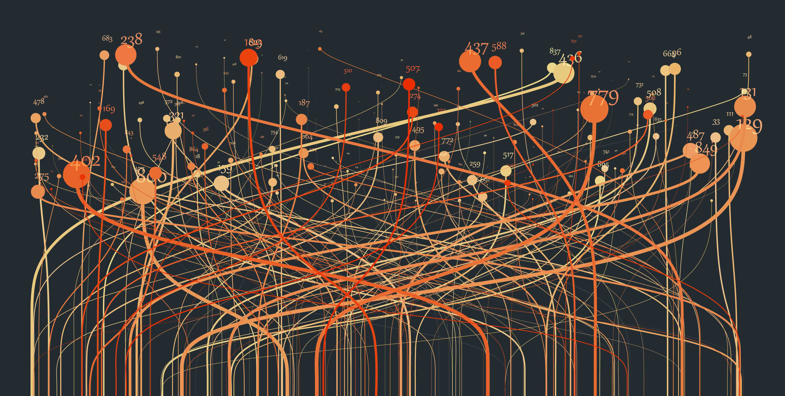
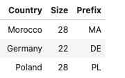

# Computer, memorize this table...

From a broad perspective as a software engineer a big part of my work consists in aligning expectations between stakeholders and creating code that transforms and forwards data. During the last 15 years I have developed software and feel fascinated by this part of computer sciences.

Curiosity and interest in other topics from the same field; data sciences and machine learning, made me decide to start a simple hands-on data science project in order to learn and practice in a typical experiment oriented approach.

After two months I had created a software different from the others I had developed so far, it "learned" from data and after that it could make "predictions", and correct ones. 

The [software result](https://bsantanna.github.io/iban-validator-model/) is an International Bank Account Number (or IBAN) validator. Given an IBAN account number the software is able to predict the country and corresponding validation format for banking account numbers.

After some research I have learned that IBAN validation is country dependent, so the first challenge was creating a machine learning model which memorizes a table with three columns; Country, Size and Prefix, following an example:

 - Country is the objective or target of the machine learning model.
 - Size corresponds to number of digits of the account number
 - Prefix corresponds to the first two digits of the account number

> Ok computer, memorize this table...

Two books later I realized how to make this question and have it answered using Machine Learning principles, by creating a classification model which predicts a probability of a value in column Country given the other columns, a simple probability and statistics model.

Next question was finding which project could help for formatting this model and passing it through a training process pipeline, the answer for that question was a selection between few frameworks with TensorFlow as choice. This framework is a toolkit for developers creating and training machine learning models by designing Artificial Neural Networks.

Final piece of the puzzle was formatting the input table and expected output into an artificial neural network model and train this artificial neural network model using the TensorFlow framework. The interactive process for solving this first challenge is documented in [this notebook](https://github.com/bsantanna/iban-validator-model/blob/main/notebooks/training/country/country_prediction_model.ipynb).

After solving the challenge of memorizing a table, nothing blocked proceeding with the next step which is training the same model but instead of using Country as target use a text block containing country and also validation rules for the country. Just re-training the same model with different input dataset, the interactive process is documented in [this notebook](https://www.kaggle.com/code/brunosantanna/iban-validator-model)

Results obtained indicated correct predictions, meaning the model has indeed learned from the table.  After observing the results of the approach and toolkit used I have the impression it was a good combination however it was not a straight forwarded process as input data formatting was challenging and the correct format was important in order to improve prediction accuracy.

While this first implementation served as a simple use case for International Bank Account Number validation, the approach explored in this use case can be applied in different tabular data use cases.

This model is distributed as an open source project and can be found in this GitHub code repository: https://github.com/bsantanna/iban-validator-model

From this research, next step is applying this model in another challenge with a larger dataset.

To conclude, as a developer I think that toolkits are making Machine Learning accessible and I feel excitement about the possibilities that this field of the computer sciences can bring not only in the future but already in the present. 

Bruno César Brito Sant'Anna.
Schiedam - The Netherlands, 25th September 2022